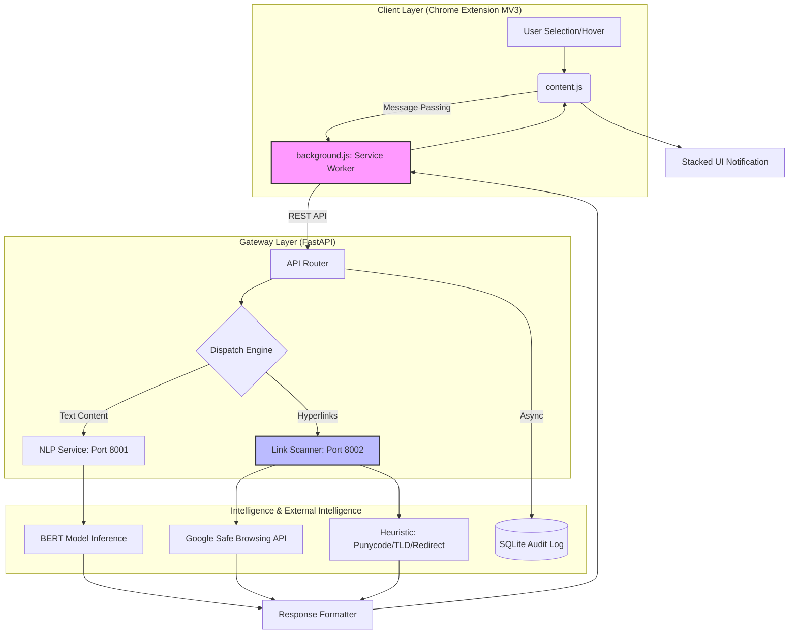
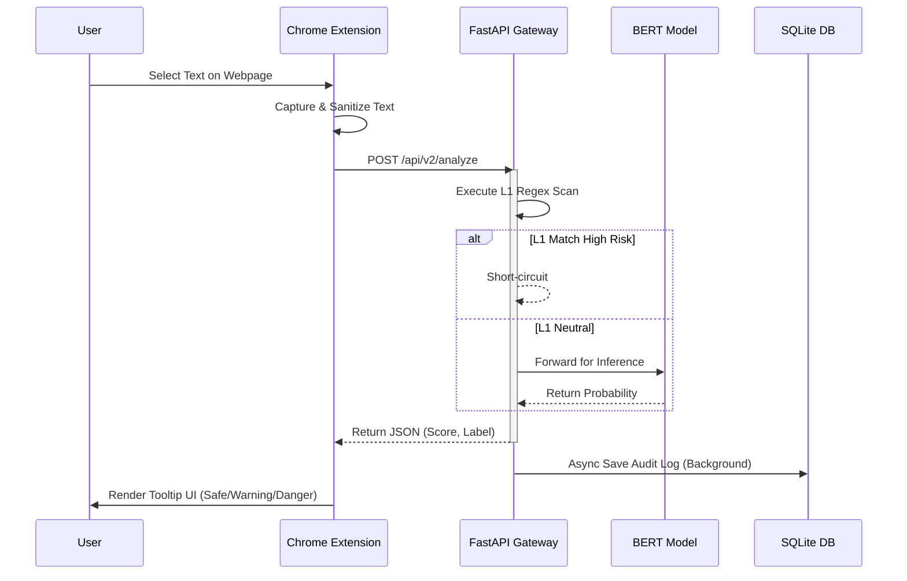
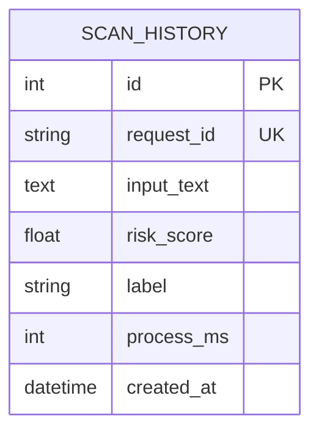
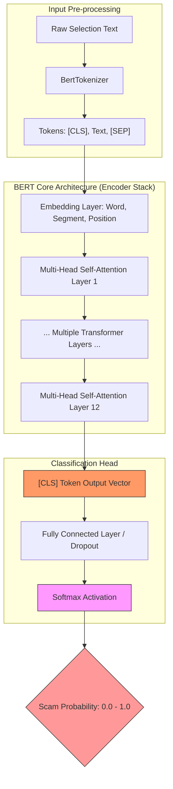
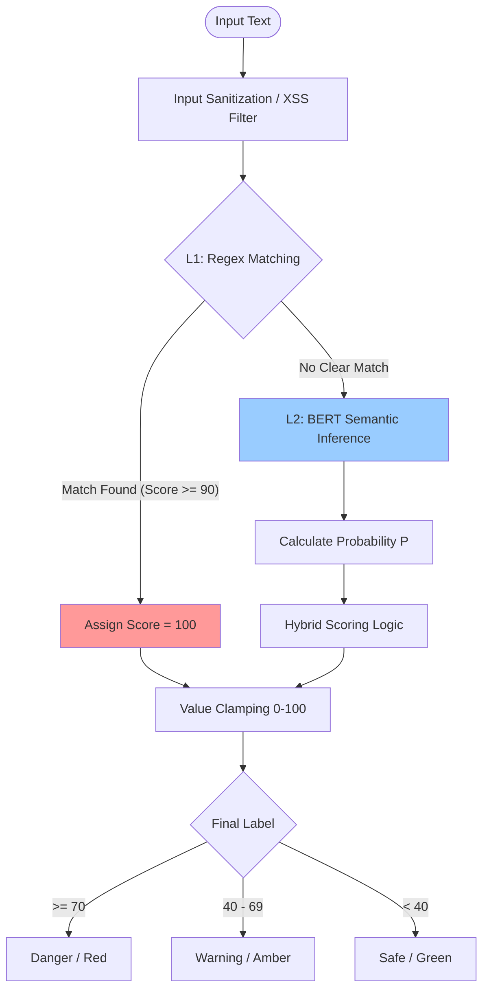
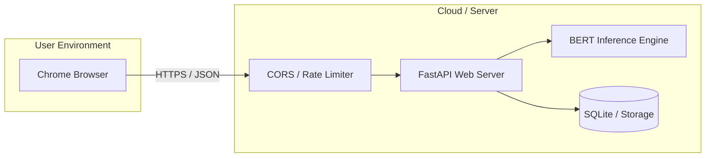
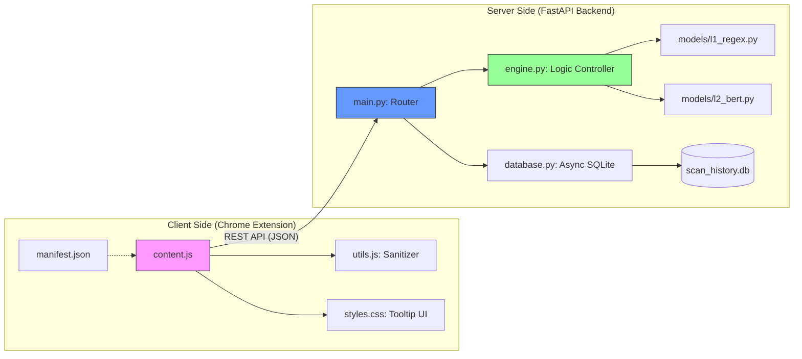

# Sentinel-Core : AI-Hybrid Security Engine
> **System Design Document**
 
---

## Section 1 - Project Description

### 1.1 Project (Project Definition)
#### 1.1.1 Project Name
**Sentinel-Core** (全稱：基於 AI 混合引擎之網頁詐騙主動預警系統)

#### 1.1.2 Naming Philosophy
本專案命名結合了「行為驅動防禦」與「智慧運算核心」兩大開發願景：

* **Sentinel (哨兵)**：
    象徵系統在用戶瀏覽行為中的「即時監控」與「前哨預警」。不同於傳統防火牆或防毒軟體的邊界防禦，本系統如同哨兵般深入用戶的日常操作（如文字選取、點擊），在威脅觸及用戶意識的第一時間即發出警訊。
* **Core (核心)**：
    代表本系統運算之重鎮——結合了 **BERT 深度學習模型** 與 **高效能規則引擎** 的「雙引擎分析核」。同時，「Core」也象徵微服務架構中的中間層網關（Gateway），負責協調前端輕量化插件與後端密集型 AI 運算資源。

#### 1.1.3 Project Slogan
> **"Selection-Driven Defense, Intelligence at the Core."**

#### 1.1.4 Project Positioning
Sentinel-Core 定位於「高精準、低負載」的次世代瀏覽器安全工具，旨在解決傳統防詐工具在面對 AI 生成詐騙內容時，反應速度緩慢與語意理解不足的問題。透過將防線部署於用戶的互動行為層級，達成主動式資安防護。


### 1.2 Description (Project Description)

#### 1.2.1 Core Mission
Sentinel-Core 的核心使命是建立一個具備語意理解能力的主動防禦屏障。傳統防詐工具多依賴靜態黑名單，難報應對 AI 生成的變種釣魚內容；本專案透過輕量化的瀏覽器擴充功能，將先進的 NLP 技術帶入用戶的日常瀏覽行為中。

#### 1.2.2 System Functionality
本系統主要提供以下核心功能：
* **Active Semantic Scanning**：針對用戶「選取文字」的動作進行即時觸發，分析該段落之安全風險百分比。
* **Dual-Engine Filtering**：結合 **L1 Regex (高效過濾)** 與 **L2 BERT (深度分析)**，確保在毫秒級的回應速度下仍能維持高度精準。
* **Visual Warning System**：根據風險等級（Safe/Warning/Danger）自動切換介面主題，提供直覺且具備心理警示效果的視覺導引。

#### 1.2.3 Technical Innovation
* **Behavior-Driven Triggering**：改採行為驅動觸發，大幅降低 CPU 與記憶體負載，解決資安工具導致系統卡頓的痛點。
* **Microservices Architecture**：採用前後端分離設計，後端透過 FastAPI 網關與 Transformers 框架執行深度學習推論。
* **Robust Data Integrity**：導入數值校正（Clamping）與 XSS 實體轉義技術，確保系統在處理惡意代碼或異常輸出時的強健度。

---

### 1.3 Revision History (Project Revision History)

#### 1.3.1 Version Control Policy
本專案採用語意化版本編號 (Semantic Versioning)，並嚴格紀錄開發里程碑與穩定性強化階段，以確保系統架構演進之可追溯性。

#### 1.3.2 Revision Log
下表詳列自開發以來之技術更迭軌跡，紀錄核心邏輯演進與功能迭代：

| Version | Description (Key Updates) |
| :--- | :--- |
| **v1.0-alpha** | **Feat**: 建立基礎 Chrome Extension DOM 監聽架構<br>**Feat**: 實作文字選取 (Selection) 偵測邏輯 |
| **v1.1-alpha** | **UI/UX**: 實作動態預警視窗 (Injection UI)<br>**UI/UX**: 加入 Safe/Warning/Danger 三色提醒動畫 |
| **v1.2-beta** | **Refactor**: 定義前後端 JSON 通訊協定 (API Schema)<br>**Feat**: 完成 FastAPI 網關與背景通訊連線 |
| **v2.0-beta** | **AI Engine**: 部署 Transformers 框架與 BERT 模型推論服務<br>**Refactor**: 實作非同步 (Async) 推論請求處理 |
| **v2.1-stable** | **Fix**: 最佳化後台資源調度，修正記憶體洩漏 (Memory Leak)<br>**Refactor**: 模組化 Detection Engine 核心邏輯 |
| **v2.2-stable** | **Refactor**: 導入 L1 Regex / L2 BERT 雙層偵測架構<br>**Test**: 通過 81 項 `pytest` 自動化單元測試 |
| **v2.3-final** | **Security**: 實作 XSS Sanitization 與數值 Clamping 防禦<br>**Feat**: 導入 `aiosqlite` 異步持久化日誌系統 |
| **v2.4-stable** | **Arch**: 導入 `service_link_scanner` (Port 8002) 支援 GSB 與啟發式檢測<br>**Refactor**: 前端遷移至 MV3 Service Worker (background.js) 架構以解決 CORS 限制<br>**Security**: 全域 SSRF 防護邏輯與多層 Redirect 鏈結追蹤機制 |
| **v3.0-dev** | **AI Engine**: 將 L2 由情感星等模型（`nlptown sentiment`）替換為 **fine-tuned 繁中六類詐騙分類器**（`hfl/chinese-roberta-wwm-ext`）<br>**Feat**: 新增 `service_explain` LLM 可解釋推理層 (Port 8004)，高風險時生成繁中解釋<br>**Eval**: 同分布測試集 macro-F1 0.998、分布外 (OOD) 真實風格 macro-F1 0.865，二元偵測 F1 均顯著優於 baseline |

#### 1.3.3 Document Status
本文件目前對應之程式碼狀態為 **`main` branch (Release Candidate)**。

---
## Section 2 - System Overview
### 2.1 Purpose (Project Purpose)

#### 2.1.1 Problem Statement
當前網際網路詐騙手段日益精密，傳統防禦機制面臨以下技術瓶頸：
* **Efficiency & Overhead**: 全頁面掃描 (Full-page scanning) 模式消耗過多終端運算資源，導致使用者瀏覽體驗劣化。
* **Semantic Gap**: 傳統關鍵字過濾 (Keyword filtering) 無法辨識上下文語境，難以應對 AI 生成的變種詐騙話術。
* **Reactive Defense**: 基於黑名單 (Blacklisting) 的防禦方式存在嚴重滯後性，對於「零時差 (Zero-day)」釣魚威脅幾乎無效。

#### 2.1.2 Proposed Solution
**Sentinel-Core** 透過「行為驅動」與「語意理解」建立次世代主動防線：
* **Precision Triggering**: 僅針對用戶選取的特定文字進行偵測，完美平衡安全性與系統載載。
* **Hybrid Intelligence**: 整合 L1 規則引擎與 L2 BERT 深度學習模型，提供具備語境感知的動態風險分析。

---

### 2.2 Scope (Project Scope)

#### 2.2.1 In-Scope
* **Client-side Extension**: 實作 Chrome 環境下的 DOM 監聽、文字擷取及動態 UI 渲染。
* **Backend Gateway**: 基於 FastAPI 之 RESTful API 服務、請求限流 (Rate Limiting) 與異常處理機制。
* **Detection Engine**: 整合 Regex 規則過濾器與 BERT 語意分析模型之推論邏輯。
* **Data Persistence**: 實作非同步 (Async) 掃描日誌儲存與基礎統計接口。

#### 2.2.2 Out-of-Scope
* 非 Chromium 系列瀏覽器 (如 Safari, Firefox) 之原生相容性支援。
* 圖片、音訊或影片等多媒體內容之詐騙偵測。
* 大規模分散式資料庫集群 (Distributed Database Cluster) 之部署。

---

### 2.3 Requirements (Project Requirements)

#### 2.3.1 Functional Requirements (FR)
* **FR-1**: 系統須能即時捕捉用戶在網頁上的選取 (Selection) 事件並觸發分析。
* **FR-2**: 系統須提供動態懸浮視窗，並根據風險分數 (0-100) 顯示對應之視覺警示。
* **FR-3**: 後端須實作混合偵測機制，優先執行 L1 規則過濾以優化運算成本。
* **FR-4**: 系統須提供歷史掃描紀錄之查詢與持久化儲存功能。


#### 2.3.2 Traceability Matrix (Requirements to Implementation)

本矩陣用於追蹤系統需求與實際程式碼實作之對應關係，確保開發活動完全符合設計初衷，並作為系統驗證之依據。

| Requirement ID | Category | Description (需求說明) | Implementation / Module (對應實作) |
| :--- | :--- | :--- | :--- |
| **FR-1** | Functional | 即時捕捉網頁文字選取事件 | `content.js`: `document.onselectionchange` 監聽器 |
| **FR-2** | Functional | 多色風險預警 UI 渲染與互動 | `content.js`: `updateTooltipUI` (Safe/Warning/Danger) |
| **FR-3** | Functional | 混合雙引擎（Regex + BERT）分析機制 | `engine.py`: `check_content` 核心推論邏輯 |
| **FR-4** | Functional | 掃描紀錄之持久化儲存與查詢 | `database.py`: `aiosqlite` 非同步寫入與讀取 |
| **NFR-1** | Performance | API 推論回應延遲 < 500ms | `main.py`: `FastAPI` 異步路由與 Transformers 快取 |
| **NFR-2** | Security | 預防選取內容引發 XSS 注入攻擊 | `content.js`: `escapeHTML` 實體轉義函數 |
| **NFR-3** | Robustness | 前端 UI 數值邊界校正 (Clamping) | `content.js`: `Math.max(0, Math.min(100, score))` |
| **NFR-4** | Scalability | 異步 I/O 與併發請求處理能力 | `main.py`: `async/await` 異步架構與 `BackgroundTasks` |
| **FR-5** | Functional | 網頁超連結批次安全掃描 | `service_link_scanner`: `URLDetector` 模組 |
| **FR-6** | Functional | 符合 MV3 規範之跨域請求處理 | `background.js`: Service Worker 代理轉發 |
| **NFR-5** | Security | 全系統層級 SSRF 請求阻斷 | `common/validators.py`: `assert_public_http_url` |
| **NFR-6** | Robustness | 異常訊息收斂與資訊洩露防護 | `api_gateway/main.py`: 錯誤遮罩處理邏輯 |

---

#### 2.3.3 Implementation Status Summary
截至 **v2.3-final** 版本，上述所有功能與非功能需求均已通過開發環境之單元測試（Unit Test）與集成測試（Integration Test）。其中針對 **NFR-2 (Security)** 與 **NFR-3 (Robustness)** 之強化，顯著提升了系統在極端輸入情境下之運作穩定性。

---
## Section 3 - System Architecture
### 3.1 High-Level Architecture

#### 3.1.1 Overview
Sentinel-Core 採用分離式架構 (Separated Architecture)，將「前端感知層」、「邏輯網關層」與「AI 推論核心」完全解耦。此設計確保了用戶端瀏覽器的輕量化，並能集中伺服器運算資源進行密集型模型推論。


#### 3.1.2 Layered Structure
* **Client Layer (Browser Extension)**:
    基於 Google Chrome **Manifest V3** 標準開發。負責網頁 DOM 監聽、選取內容擷取、以及動態 UI 的渲染與數據淨化 (Sanitization)。
* **Gateway Layer (FastAPI Backend)**:
    系統之中樞神經。負責處理 RESTful 請求、執行 L1 規則過濾、管理非同步背景任務 (BackgroundTasks) 以及執行資料庫持久化交互。
* **Intelligence Layer (NLP Engine)**:
    基於 Hugging Face **Transformers** 框架封裝的 **BERT** 模型。負責高維度的語意向量運算，並回傳精準的風險機率分布數據。

---

### 3.2 Component Interaction (組件互動流程)

#### 3.2.1 Sequence of Operations
當用戶在網頁上執行文字選取行為時，系統遵循以下標準序列：
1.  **Selection Capture**: `content.js` 偵測到選取事件，即時擷取文字區塊 (Text Blob)。
2.  **Request Dispatch**: 插件將內容封裝為標準 JSON 格式，透過非同步 `fetch` 發送至後端網關。
3.  **Hybrid Detection Processing**:
    * **L1 Step**: 後端先行執行 Regex 匹配，若命中高風險規則則直接回標記。
    * **L2 Step**: 若 L1 未命中，則將文本送入 BERT 模型執行深層語意分析。
4.  **Asynchronous Logging**: 後端在回傳分析結果的同時，啟動 `BackgroundTasks` 將紀錄寫入 SQLite，達成零延遲響應。
5.  **UI Feedback**: 前端接收 Response 後，執行 **Clamping (數值校正)** 並根據風險等級渲染警示視窗。



---

### 3.3 Communication Protocol (通訊協定)

#### 3.3.1 Interface Specification
前後端通訊完全遵循 **RESTful API** 規範，數據交換標準如下：
* **Transmission Format**: JSON (UTF-8 Encoding)。
* **Endpoint Target**: `POST /v2/analyze`。
* **Data Integrity**: 傳輸過程中確保所有文本皆經過標準轉義，避免特殊字元（如 HTML 標籤）導致的解析錯誤或潛在的 Injection 威脅。

#### 3.3.2 Async Architecture Benefits
透過 `async/await` 非同步機制，系統能在不阻塞主執行緒的情況下處理高併發請求，確保瀏覽器端即便在網路不穩定的情境下，亦不會造成網頁卡頓。

---
## Section 4 - Data Dictionary

### 4.1 Overview (Data Overview)
本章節詳列 Sentinel-Core 系統中所使用的數據實體、API 傳輸格式以及持久化儲存之欄位定義。所有數據處理均遵循 UTF-8 編碼規範，並在傳輸與儲存前進行必要的數據清洗 (Data Cleaning) 與轉義處理。

---

### 4.2 Data Entity Dictionary (數據實體字典)
針對系統核心對象進行邏輯定義，確保開發過程中語意的一致性：

| Entity Name | Description | Key Attributes |
| :--- | :--- | :--- |
| **AnalysisTask** | 用戶發起的單次掃描請求實體 | TextContent, SourceURL, Timestamp |
| **SecurityScore** | 偵測引擎回傳之風險量化指標 | L1_Result, L2_Probability, FinalScore |
| **AuditLog** | 用於系統審核與統計之持久化紀錄 | RequestID, ResultStatus, Latency_ms |

---

### 4.3 Interface Data Structures (API 數據結構)
定義前端 (Chrome Extension) 與後端 (FastAPI) 之間交換的標準 JSON 格式。

#### 4.3.1 AnalyzeRequest (Client to Server)
本物件由插件背景腳本發送，封裝用戶選取的待分析內容。
```json
{
  "text": "String (待分析之原始選取文字內容)",
  "url": "String (來源網頁之完整網址)",
  "context_length": "Integer (文本字元長度)"
}
```

#### 4.3.2 AnalyzeResponse (Server to Client)
本物件由網關回傳，包含引擎分析結果與 UI 渲染所需之元數據。
```json
{
  "score": "Float (0.0 - 100.0，經過 Clamping 校正之風險分)",
  "label": "String (Safe / Warning / Danger 分級標籤)",
  "engine_used": "String (標示觸發之引擎：L1-Regex / L2-BERT)",
  "reason": "String (風險觸發之具體原因描述)",
  "request_id": "String (UUID v4，用於後端日誌追蹤)"
}
```

---

### 4.4 Database Schema (資料庫欄位定義)
本系統使用 `aiosqlite` 進行非同步數據持久化。核心資料表 `scan_history` 定義如下：

| Column Name | Data Type | Constraints | Description |
| :--- | :--- | :--- | :--- |
| **id** | INTEGER | PRIMARY KEY, AUTOINC | 系統內部唯一辨識碼 |
| **request_id** | VARCHAR(36) | UNIQUE, NOT NULL | 對應 API 之唯一追蹤碼 |
| **input_text** | TEXT | NOT NULL | 原始選取文本 (經 XSS 轉義處理) |
| **risk_score** | REAL | NOT NULL | 雙引擎計算後之最終風險分數 |
| **label** | VARCHAR(10) | NOT NULL | 風險分級標籤 (預警狀態) |
| **process_ms** | INTEGER | NOT NULL | 引擎處理延遲 (毫秒) |
| **created_at** | DATETIME | DEFAULT CURRENT_TIMESTAMP | 紀錄建立之系統時間 |


---

### 4.5 Transient Data (暫時性數據)
在分析流程中，系統會產生以下暫時性數據：
* **Regex Match Buffer**: L1 引擎匹配時產生的臨時字串片段。
* **BERT Tensors**: 模型推論過程中產生的向量維度數據，推論完成後即由記憶體回收。

## Section 5 - Software Domain Design (軟體領域設計)
### 5.1 Overview (Detection Architecture)
Sentinel-Core 的偵測核心採用**雙層過濾機制 (Dual-Layer Filtering)**。此設計兼顧了規則匹配的高效性與深度學習模型對未知威脅的理解能力，有效解決了單一引擎容易產生的誤判 (False Positive) 或漏判 (False Negative) 問題。

---

### 5.2 Layer 1: Rule-Based Engine (Regex Engine)

#### 5.2.1 Design Principle
L1 引擎作為系統的第一道防線，主要處理具備強烈特徵的已知詐騙模式（如：特定短網址格式、銀行帳號誘導、緊急促使性關鍵字）。其核心優勢在於 **O(n)** 的時間複雜度，能在極短時間內過濾掉大量基礎威脅。

#### 5.2.2 Pattern Matching Strategy
* **Predefined Heuristics**: 內建針對釣魚網站常見詞彙（如「帳號異常」、「中獎領取」）的正規表示式庫。
* **Entropy Analysis**: 計算選取文本中特殊字元與隨機字串的比例，用於偵測經過混淆處理的惡意連結或代碼。

---

### 5.3 Layer 2: Semantic Analysis Engine (BERT Model)

#### 5.3.1 Model Architecture
當 L1 引擎無法給出確定性結論時，系統調用一個**針對台灣詐騙話術 fine-tune 的繁中分類模型**進行深層分析。基礎模型採用中文全詞遮罩的 **`hfl/chinese-roberta-wwm-ext`**（RoBERTa-wwm），於分類頭輸出六個類別。
* **Contextual Embedding**: 不同於簡單關鍵字比對，模型理解詞彙在句子中的前後語境關係，能辨識「假冒官方通知」與「一般正常討論」之差異。
* **6-class Softmax**: 模型輸出六類機率分布——`phishing`（釣魚）、`investment_scam`（假投資）、`romance_scam`（感情詐騙）、`parcel_scam`（假包裹）、`gov_impersonation`（假冒政府）、`safe`（正常）。系統以 `trust_score = P(safe) × 100` 換算信任分數，並回傳偵測到的詐騙類型。

#### 5.3.2 Model Fine-tuning（資料與訓練方法）
* **資料策略（混合式）**: 由於台灣繁中詐騙語料無現成大型公開資料集（165 詐騙 LINE ID 開放資料已於 2024/11 因打詐新法下架），本專案以**真實話術為種子**（165／刑事局公開話術、新聞案例、各類詐騙截圖文字）並輔以**模板 / LLM 式語意增強**平衡六類別，負樣本取自正常客服、廣告、新聞與日常對話，共建構約 4,100 筆標註語料（`service_nlp/train/`，可由種子重現）。
* **訓練**: 於本地 NVIDIA GPU 以 fp16 微調（HuggingFace `Trainer`，3 epochs），訓練腳本 `fine_tune.py`。
* **評估（含誠實的泛化測試）**: 除同分布測試集外，另建立**手寫的分布外 (OOD) 真實風格測試集**（含「合法銀行/物流通知」等難負樣本）以檢驗真實泛化能力。詳見 §10.4。


---

### 5.4 Hybrid Logic & Decision Flow (混合邏輯與決策流)

#### 5.4.1 Scoring Algorithm
系統最終風險分數 $S_{final}$ 的計算邏輯結合了靜態規則與動態推論：

$$S_{final} = \max(S_{L1}, S_{L2} \times W_{semantic})$$

其中 $W_{semantic}$ 為語意權重因子，用於調節 AI 模型對最終決策的影響力，確保在邊界案例中能維持判斷的穩定性。

#### 5.4.2 Execution Pipeline
1.  **Normalization**: 預處理階段，移除文本中的多餘空格與控制字元。
2.  **L1 Fast-Path**: 若 Regex 匹配到極高風險特徵，直接回傳 $Score = 100$ 並中斷後續運算以節省資源。
3.  **L2 Deep-Path**: 調用後端 GPU/CPU 資源進行 Tensor 運算，取得語意分析機率值。
4.  **Result Clamping**: 執行數值校正，確保最終輸出嚴格落在 $[0, 100]$ 區間內。



---

### 5.5 Reliability & Safety (可靠性與安全性設計)

#### 5.5.1 Fallback Mechanism (降級機制)
當 AI 推論服務因高併發負載或網路異常無法及時回應時，系統會自動降級為「純規則偵測模式」，確保用戶瀏覽器不會因等待回傳而產生假死現象，維持系統高可用性。

#### 5.5.2 Input Sanitization (輸入淨化)
在將選取文本送入任何偵測引擎前，系統會強制執行實體轉義 (Entity Escape)，防止攻擊者利用惡意構造的文本發動 **Prompt Injection** 或 **XSS 反向攻擊** 滲入插件後端。

### 5.6 Link Scanner Engine Logic (連結掃描引擎邏輯)

#### 5.6.1 Heuristic & External Analysis
連結掃描引擎採用雙軌制驗證。除了透過 Google Safe Browsing (GSB) 進行權威比對外，實作了啟發式偵測器：
* **Punycode Detection**: 識別使用國際化網域字元（如 Cyrillic 字母）偽造知名品牌網域的行為（例如將 `аррӏе.com` 偽裝成 `apple.com`）。
* **TLD Risk Assessment**: 針對 `.xyz`、`.tk`、`.ml` 等低成本或高濫用率之頂級域名進行加權扣分。

#### 5.6.2 Redirect Chain Tracking
針對惡意釣魚連結常見的層層跳轉 (Multi-hop redirects)，系統會自動追蹤跳轉鏈。預設超過 3 層跳轉即標記為「可疑 (Warning)」，超過 5 層或跳轉至私有 IP 則立即封鎖，防止利用跳轉隱藏最終釣魚頁面。

### 5.7 LLM Explainability Layer (可解釋推理層)

#### 5.7.1 Purpose
為將系統從「黑盒分類器」升級為「推理透明的決策系統」，v3.0 新增 `service_explain` 服務 (Port 8004)。當偵測結果為高風險 (Danger) 時，Gateway 會彙整多引擎訊號（NLP 類別/信任分數、URL 風險、原始文字片段）轉發至此服務，由 **Claude API** 生成 100–120 字的繁體中文風險解釋，引用具體偵測訊號並給出行動建議。

#### 5.7.2 Graceful Degradation
此層具備**降級設計**：若環境未設定 `ANTHROPIC_API_KEY`，服務自動改用規則式 (deterministic) 解釋產生器，仍引用真實偵測訊號並附上 165 反詐騙專線建議，確保離線或無金鑰時 demo 仍可運作。解釋失敗亦不影響主要分析結果（非阻斷式）。

## Section 6 - Hardware Domain Design (硬體領域設計)

### 6.1 Overview (Hardware Environment)
Sentinel-Core 採用端雲協作 (Edge-Cloud Collaboration) 架構。前端插件運行於用戶終端設備，強調低功耗與無感化運行；後端推論服務則部署於具備高效能計算資源之伺服器節點，以支援大規模語意向量運算。



---

### 6.2 Client-Side Specifications (前端終端規格)
由於本系統作為瀏覽器擴充功能 (Chrome Extension) 運行，其硬體需求與主瀏覽器程序 (Host Browser) 共享，基本規格要求如下：
* **Processor**: x86_64 或 ARM64 架構處理器（如 Intel Core i3 / Apple M1 以上）。
* **Memory (RAM)**: 插件靜態運行時之額外內存佔用須低於 **50MB**，確保不影響宿主網頁之渲染流暢度與系統穩定性。
* **Network**: 具備穩定的網際網路連線，用於與後端分析網關進行毫秒級的 RESTful API 通訊。

---

### 6.3 Server-Side Specifications (伺服器推論規格)
後端分析引擎針對 **BERT-Base** 模型之部署需求與併發處理能力，定義以下硬體配置：

| Component | Minimum Specification | Recommended Specification |
| :--- | :--- | :--- |
| **CPU** | 2-Core x86_64 2.0GHz+ | 4-Core+ High Frequency Processor (如 Xeon / EPYC) |
| **GPU** | N/A (Support CPU Inference) | NVIDIA Tesla T4 / RTX 30 系列 (支援 CUDA 11+) |
| **Memory** | 4GB RAM | 8GB+ RAM (用於優化模型權重載入與 Context 快取) |
| **Storage** | 10GB SSD | 20GB+ NVMe SSD (加速模型加載與 SQLite 異步寫入) |

---

### 6.4 Resource Optimization Strategies (資源優化策略)

#### 6.4.1 Model Quantization (模型量化)
為優化推論效能並降低伺服器硬體成本，系統支援將 BERT 模型進行 **INT8 量化** 處理。此技術能在減少約 50% 內存佔用的情況下，維持 95% 以上的語意辨識準確度，並顯著降低推論延遲。

#### 6.4.2 Async Resource Pooling (異步資源池)
後端網關透過 FastAPI 之 `async/await` 機制，對資料庫連線 (SQLite) 與模型推論佇列進行非阻塞式管理，確保在有限的 CPU 資源下，仍具備支撐多用戶同時發起掃描請求之併發能力。

## Section 7 - User Interface Design (使用者介面設計)

---

### 7.1 Design Philosophy (設計理念)
Sentinel-Core 的 UI 設計遵循「最小干擾 (Minimal Intrusion)」與「高警示性 (High Alertness)」原則。系統平時隱藏於背景，僅在用戶執行文字選取動作時主動彈出，確保不影響網頁原始排版。

---

### 7.2 UI Components & Layout (介面組件與佈局)

#### 7.2.1 Selection-Driven Tooltip
核心互動組件為一個基於 Shadow DOM 技術實作的動態懸浮視窗 (Tooltip)。
* **Dynamic Positioning**: 視窗位置會自動計算用戶選取範圍 (Text Range) 之座標，確保出現在選取文字的正上方或正下方。
* **Shadow DOM Encapsulation**: 採用 Shadow DOM 技術進行樣式隔離，防止目標網站的 CSS 影響插件 UI，確保介面一致性。

#### 7.2.2 Traffic-Light Warning System (三色預警系統)
系統根據 AI 引擎回傳之風險分數，動態切換三種預警模式：

| Risk Level | Score Range | UI Color (Hex) | Description |
| :--- | :--- | :--- | :--- |
| **Safe** | 0 - 39 | #4CAF50 (Green) | 語意分析正常，無明顯詐騙特徵。 |
| **Warning** | 40 - 69 | #FFC107 (Amber) | 偵測到可疑語境或誘導性詞彙，建議提高警覺。 |
| **Danger** | 70 - 100 | #F44336 (Red) | 命中已知詐騙模式或高風險 AI 語境，強烈警告。 |

---

### 7.3 User Interaction Flow (用戶互動流程)

1.  **Selection (Trigger)**: 用戶在網頁上選取一段可疑文字。
2.  **Loading State**: Tooltip 顯示微縮動畫 (Loading Spinner)，代表後端正在執行 L1/L2 混合推論。
3.  **Analysis Results**: 視窗展開並顯示風險分數、風險等級顏色標籤及偵測依據（如「偵測到銀行詐騙特徵」）。
4.  **Action Prompt**: 提供「了解更多」或「關閉預警」之按鈕引導用戶下一步行動。

---

### 7.4 Accessibility & Robustness (易用性與強健性)

#### 7.4.1 Responsive Scaling
UI 支援自動縮放，確保在不同解析度的螢幕（如 4K 顯示器或筆電螢幕）上皆具備良好的閱讀性。

#### 7.4.2 Visual Safe-Guards (視覺防護)
* **Contrast Ratio**: 文字與背景顏色對比符合 Web Content Accessibility Guidelines (WCAG) 標準，確保色弱或視能受損用戶能清楚辨識危險等級。
* **Clamping Display**: 前端顯示之風險分數經由 `Math.round()` 取整數並透過 `Clamping` 函數處理，避免出現異常的小數點或超出範圍的數值影響用戶判斷。


## Section 8 - Detailed Design (詳細設計)

### 8.1 Module Specification (模組詳細規格)

#### 8.1.1 Detection Engine Logic (混合偵測邏輯)
這是系統的核心控制器，負責協調 L1 (Regex) 與 L2 (BERT) 的執行順序。其設計目標是在確保安全性的前提下，極大化運算效率並降低伺服器負載。

**Pseudo-code: Dual-Engine Controller**
```python
def analyze_content(text):
    # Step 1: Pre-processing & Sanitization
    # 清洗文本並執行實體轉義
    clean_text = sanitize_input(text)
    
    # Step 2: Layer 1 - Fast Regex Scan
    # 執行高效能正規表達式匹配
    l1_score = regex_engine.match(clean_text)
    if l1_score >= THRESHOLD_CRITICAL:
        # 若命中極高風險特徵，直接跳過 AI 推論
        return create_response(score=100, label="Danger", engine="L1-Regex")
    
    # Step 3: Layer 2 - Deep AI Inference
    try:
        # 調用 BERT 模型執行語意推論
        semantic_prob = bert_model.predict(clean_text)
        final_score = calculate_hybrid_score(l1_score, semantic_prob)
    except InferenceError:
        # Fallback Mechanism: 推論失敗時降級為 L1 結果
        final_score = l1_score
        
    return create_response(score=final_score, engine="Hybrid")
```

#### 8.1.2 UI Security Layer (前端安全處理)
為防止惡意文本透過選取機制破壞插件 UI 或執行腳本注入，系統在 `content.js` 中實作了嚴格的數據淨化與邊界校正。

**Pseudo-code: Frontend Sanitization & Clamping**
```javascript
function updateTooltipUI(rawScore, rawText) {
    // 1. 數值邊界校正 (Clamping): 確保百分比落在 [0, 100]
    const safeScore = Math.max(0, Math.min(100, Math.round(rawScore)));
    
    // 2. HTML 實體轉義 (Sanitization): 預防 XSS 注入
    const safeText = rawText.replace(/&/g, "&amp;")
                            .replace(/</g, "&lt;")
                            .replace(/>/g, "&gt;");
                            
    // 3. 根據校正後的分數渲染組件
    renderShadowDOM(safeScore, safeText);
}
```

---

### 8.2 Database Detail Design (資料庫詳細設計)

#### 8.2.1 Asynchronous Logging Flow
系統採用非阻塞式 (Non-blocking) 寫入架構。當分析結果產生後，網關會優先回傳數據給用戶，隨後在背景執行持久化操作。

* **Task Queueing**: 使用 FastAPI 的 `BackgroundTasks` 進行非同步排隊，避免磁碟 I/O 阻塞 API 響應。
* **Persistence Logic**: 透過 `aiosqlite` 維持單一寫入連線池，解決 SQLite 在併發寫入時的資料庫鎖定 (Database Lock) 問題。

---

### 8.3 Exception & Error Handling (異常處理機制)

系統針對可能發生的執行環境異常，定義了以下標準化處理方案：

| Error Scenario | Detection Method | Mitigation Strategy (緩解策略) |
| :--- | :--- | :--- |
| **Model Inference Timeout** | 後端監聽 Timer | 自動切換至 L1 模式，回傳基礎風險值並記錄錯誤日誌。 |
| **Malformed JSON Payload** | Pydantic Schema 驗證 | 回傳 HTTP 422 錯誤碼，並提供 Request ID 以利追蹤。 |
| **DOM Style Conflict** | Shadow DOM 封裝 | 使用最高的 `z-index` 並隔離 CSS 命名空間，確保 UI 正常顯示。 |
| **Network Unreachable** | 前端 `try-catch` | 顯示離線預警模式 (Offline Mode)，提示用戶暫時無法使用語意分析。 |
| **Internal IP Access (SSRF)** | `common/validators` | 偵測到私有 IP 請求時直接終止，不回傳內部網絡探測結果。 |
| **Service Error Leakage** | 全域 Exception Handler | 隱藏底層 Traceback 與 `str(e)`，改回傳預設語意化錯誤提示。 |

---

### 8.4 State Machine Design (狀態機設計)
系統運行流程遵循明確的狀態轉換，確保在「選取」、「分析」、「顯示」、「清除」四個階段中保持記憶體與 DOM 狀態的乾淨：
1. **IDLE**: 監聽選取事件。
2. **ANALYZING**: 顯示 Loading 動畫，禁止重複請求。
3. **DISPLAYING**: 渲染結果視窗，執行 Clamping 校正。
4. **CLEANING**: 點擊空白處或重新選取時，主動銷毀舊有 Tooltip 實體。

## Section 9 - External Interface Design (外部介面設計)

### 9.1 Overview (Interface Strategy)
Sentinel-Core 採用標準化 RESTful API 架構，確保前端廣播插件與後端 AI 分析引擎之間的數據交換具備高一致性與可擴展性。所有介面皆強制要求 JSON 格式，並採用非同步處理機制以極大化響應速度。

---

### 9.2 RESTful API Specification (API 規格定義)

#### 9.2.1 Text Analysis Endpoint
本接口為系統核心，負責接收待掃描文本並回傳雙引擎分析結果。

* **Endpoint**: `/api/v2/analyze`
* **Method**: `POST`
* **Content-Type**: `application/json`

**Request Body (請求主體):**
| Field | Type | Required | Description |
| :--- | :--- | :--- | :--- |
| `text_content` | String | Yes | 用戶於網頁上選取之原始文本內容。 |
| `source_url` | String | Yes | 觸發偵測行為之來源網頁完整 URL。 |
| `timestamp` | Float | No | 用戶端發起請求之 Unix 時間戳。 |

**Response Body (回應主體):**
| Field | Type | Description |
| :--- | :--- | :--- |
| `risk_score` | Float | 最終整合之風險分數 (0.0 - 100.0)。 |
| `risk_level` | String | 視覺標籤 (Safe / Warning / Danger)。 |
| `engine_info` | String | 執行路徑標記 (e.g., "L1-Match", "L2-Inference")。 |
| `request_id` | String | 唯一追蹤碼 (UUID)，用於日誌對照。 |

### 9.2.2 Link Analysis Endpoint
本接口負責批次處理網頁中的超連結風險評估。

* **Endpoint**: `POST /api/v2/analyze/links`
* **Method**: `POST`
* **Rate Limit**: 30 requests / minute
* **Payload (JSON)**:
```json
{
  "urls": ["String List (待掃描連結清單)"],
  "source_url": "String (發起掃描之來源網址)"
}
```
---

### 9.3 Error Interface Standards (異常回傳標準)
系統遵循標準 HTTP 狀態碼進行異常定義，確保前端能針對不同錯誤情境給予用戶正確反饋：

| Status Code | Error Label | Handling Strategy |
| :--- | :--- | :--- |
| **400** | Bad Request | 請求格式錯誤或 `text_content` 為空，前端停止重試。 |
| **422** | Unprocessable Entity | Pydantic 驗證失敗，通常為數據類型不符。 |
| **429** | Too Many Requests | 觸發 Rate Limiting (限流)，前端應啟動退避演算法。 |
| **500** | Internal Server Error | 後端引擎崩潰，系統自動觸發 Fallback 降級模式。 |

---

### 9.4 Security & Authentication (接口安全性)

#### 9.4.1 Cross-Origin Resource Sharing (CORS)
由於 Chrome Extension 的運行環境特殊，後端網關已實作嚴格的 CORS 白名單策略，僅允許具備特定 `chrome-extension://` 標頭的請求進行通訊，有效防止跨站請求偽造 (CSRF) 攻擊。

#### 9.4.2 Rate Limiting (頻率限制)
為防止惡意自動化腳本消耗 AI 推論資源，API 層級部署了基於 IP 與 Request ID 的限流機制，確保正常用戶能穩定獲取分析服務。

## Section 10 - Testing & Validation (測試與驗證)

---

### 10.1 Overview (Testing Strategy)
本專案採用自動化測試驅動開發 (TDD) 理念，針對核心邏輯、邊界案例與異常輸入進行全面驗證。測試層級涵蓋單元測試 (Unit Test)、整合測試 (Integration Test) 與使用者驗證測試 (UAT)，確保系統在正式發佈前達到高度穩定性與正確性。

---

### 10.2 Test Environment & Tools (測試環境與工具)
為確保測試結果的可重複性，本專案建置了標準化測試環境：
* **Testing Framework**: Python 端採用 `pytest`；前端採用 `Jest`。
* **CI Pipeline**: 透過 GitHub Actions 模擬多作業系統環境之自動化測試。
* **Mocking Strategy**: 針對 BERT 推論服務與 SQLite I/O 實作 Mock 物件，以提升大規模測試案例之運行效率。

---

### 10.3 Test Case Classification (測試案例分類)
系統針對不同維度執行了共計 **105 項自動化測試案例**，具體分布如下：

| Test Category | Count | Description (測試重點) |
| :--- | :--- | :--- |
| **Normal Logic** | 35 | 驗證標準詐騙語句與一般正常文本之分類準確度。 |
| **Boundary Conditions** | 20 | 測試極長文本、空字串及特殊不可見字元之邊界處理。 |
| **Security Injection** | 15 | 驗證 XSS 實體轉義與 SQL 指令注入之過濾攔截成效。 |
| **Concurrency & Load** | 11 | 模擬多個 Client 同時發起請求時，後端之非同步處理能力。 |
| **AI / XAI Integration** | 24 | v3.0：fine-tuned 模型六類分類整合測試、LLM 解釋服務與高風險融合觸發邏輯。 |

---

### 10.4 Test Execution Results (測試執行結果)

#### 10.4.1 Summary Metrics
| Metric | Execution Result | Target |
| :--- | :--- | :--- |
| **Total Test Cases** | 105 | - |
| **Overall Pass Rate** | 100% | > 95% |
| **System Failures** | 0 | 0 |

#### 10.4.2 Model Classification Performance (L2 模型分類效能)
fine-tuned 六類詐騙分類器之評估結果（`service_nlp/train/evaluate.py`，混淆矩陣見 `reports/`）：

| 測試集 | 6 類 macro-F1 | 二元 (scam/safe) F1 — fine-tuned | 二元 F1 — baseline (情感星等) |
| :--- | :--- | :--- | :--- |
| 同分布 (in-distribution) | **0.998** | **1.000** | 0.818 |
| 分布外 (OOD, 真實風格) | **0.865** | **0.894** | 0.750 |

* **對比實驗**: fine-tuned 模型在兩個測試集上均**顯著優於** baseline（原情感星等換算法）。
* **泛化分析（誠實揭露）**: 同分布近乎滿分反映模型能完整學習語料樣式；OOD 分數下降屬預期，反映真實世界泛化能力，且仍勝過 baseline。OOD 混淆矩陣顯示主要誤判來自口語化投資詐騙與「含金融關鍵字的合法通知」難負樣本，為後續改進方向。

#### 10.4.3 Latency (效能目標)
* **設計目標 (NFR-1)**: 端到端回應 < 500ms。L1 規則命中為毫秒級短路；L2 於本地 GPU 推論單句約數十毫秒。
* **說明**: 高風險時額外觸發 LLM 解釋層會增加延遲，故採非阻斷式設計，主要分析結果先行回傳。


---

### 10.5 User Acceptance Testing (UAT)
由開發團隊成員模擬真實終端用戶進行黑箱測試 (Black-box Testing)，確認：
1. **Interactive Accuracy**: 懸浮視窗彈出座標精準度達 100%。
2. **Visual Guidance**: 三色預警系統與風險分數之語意對應符合用戶直覺。
3. **Cross-Site Stability**: 於社群媒體 (Facebook)、新聞網 (CNN) 與技術論壇 (StackOverflow) 等多樣化站點皆能穩定運行。

---

### 10.6 Conclusion (專案總結)
**Sentinel-Core** 成功實作了基於 AI 多引擎之網頁詐騙主動預警系統。透過「行為驅動」設計有效平衡了資安防護與系統負載；v3.0 更將語意核心從通用情感模型升級為**針對台灣詐騙話術 fine-tune 的繁中六類分類器**，以對比實驗與分布外測試驗證其相對 baseline 的顯著提升，補足了傳統規則引擎在語意理解上的缺陷。新增的 **LLM 可解釋推理層** 則將系統由黑盒分類器提升為推理透明的決策系統。結合 v2.4 的 MV3 架構重構、SSRF 防護與連結掃描模組，本系統已具備從語意理解、可解釋推理到網絡基礎設施層級的全方位資安偵測能力。
